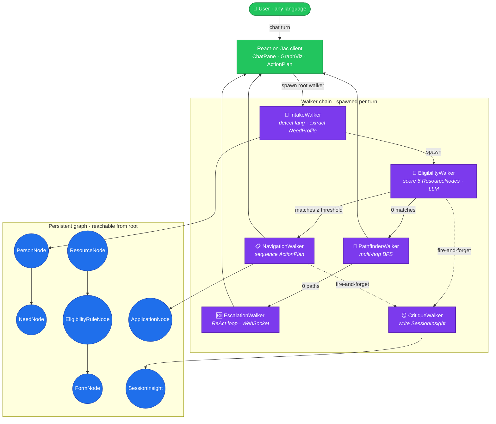
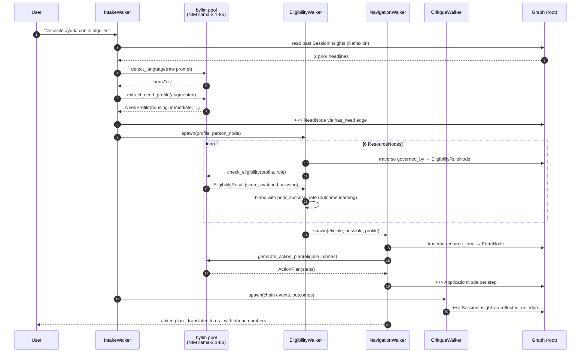
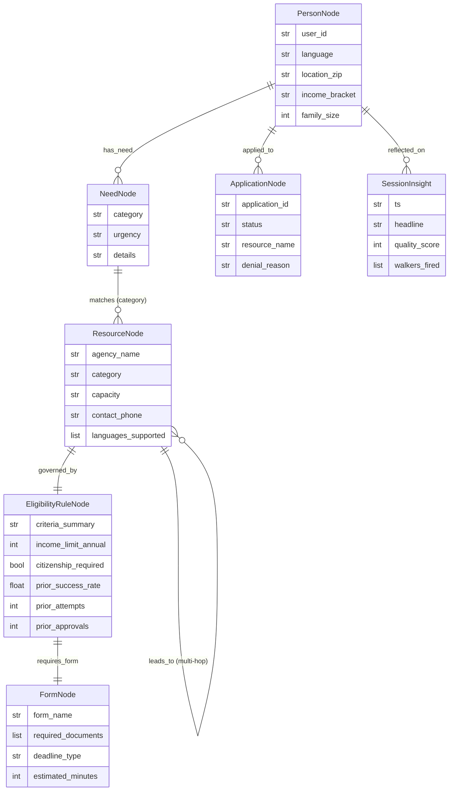
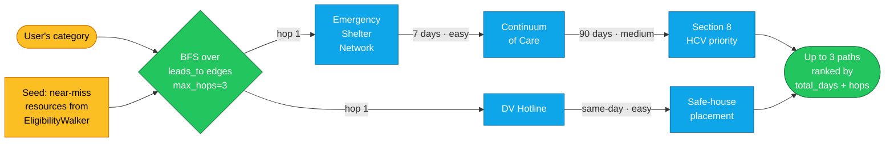
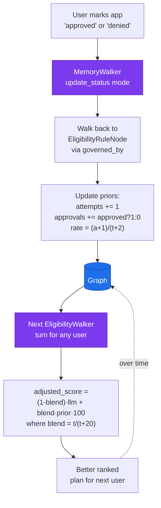
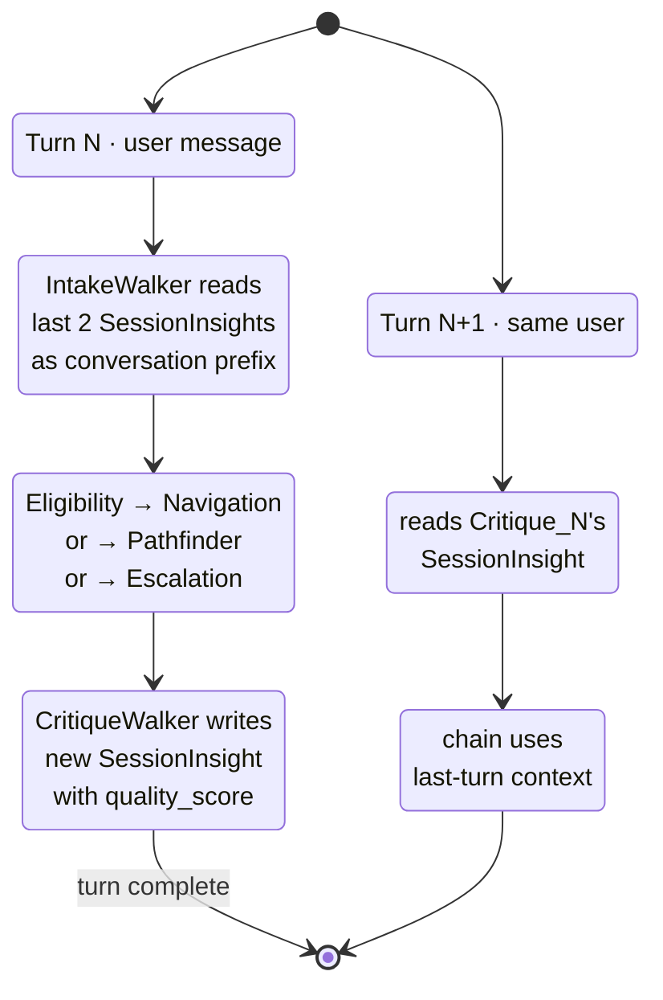

<div align="center">

# CivicMesh

### A multi-agent AI navigator that routes people in crisis to the housing, food, healthcare, and legal aid they qualify for — in any language, in under a minute.

[](https://github.com/Jaseci-Labs/jaclang)
[](https://jaseci.org)
[](https://github.com/Jaseci-Labs/byllm)
[](https://build.nvidia.com)
[](./LICENSE)
[](https://jaseci.org)

</div>

---

## The problem

Tens of millions of vulnerable people — single mothers, undocumented families, elderly tenants on fixed incomes — do not know which programs they qualify for, what documents they need, or which agency to call first. The safety net is real, but it is buried behind fragmented websites, English-only intake forms, and screening logic that takes a caseworker to decode.

CivicMesh is a **graph-native multi-agent navigator** built on Jac. One sentence in any language → a ranked, eligibility-checked, multilingual action plan. With **phone numbers up front**.

---

## What makes it different

Three innovations no other Jac project has shipped:

| | Innovation | Why it matters |
|---|---|---|
| 🧭 | **Pathfinder** — multi-hop BFS over `leads_to` edges between resources | When a user doesn't qualify *directly*, the graph finds a 2-3 step escape route (e.g. *Emergency Shelter → Continuum of Care → Section 8*). Graph-RAG over a curated civic-aid knowledge graph. |
| 🧠 | **Outcome-Learning Eligibility** — Bayesian priors on `EligibilityRuleNode` | Every approved/denied `ApplicationNode` updates a Laplace-smoothed success prior on the gating rule. The graph **gets smarter every time someone uses it** — no PyTorch, no retraining, just Jac OSP. |
| 🔁 | **Reflexion self-reflection loop** | `CritiqueWalker` writes a `SessionInsight` after every turn; the next `IntakeWalker` reads the last two as conversation prefix. The agent literally **reads its own past performance as memory** — Shinn et al. (2023) implemented as native graph edges. |

---

## Architecture



The chain is **lazy-branching**: EligibilityWalker only spawns NavigationWalker if matches exist, only spawns PathfinderWalker on a dead end, and only spawns EscalationWalker if Pathfinder also fails. CritiqueWalker fires at the end regardless — the post-turn self-reflection is mandatory.

---

## Walker path · the happy path

A typical successful turn — *"I'm a single mom, need help with rent, two kids, $1,200/month"* — traces this exact path through the graph:



---

## Graph schema

Every node and edge ships with a `sem` semstring; byllm reads those strings as grounding when generating structured output, so the schema *is* the prompt context.



---

## Dead-end recovery · Pathfinder

When EligibilityWalker scores **zero** matches above threshold, we don't drop straight to crisis. Pathfinder runs BFS over the typed `leads_to` edge — 25+ curated real-world resource transitions (DV Hotline → Emergency Shelter → Section 8, SNAP intake → WIC pre-qualification, etc.) — to discover **multi-step escape paths**:



This is **graph-RAG** applied to social services — the 2026 RAG frontier, native to Jac, with zero external vector store.

---

## Outcome learning · the graph gets smarter

Every terminal `ApplicationNode.status` update (`approved` or `denied`) walks back to the gating `EligibilityRuleNode` and updates a **Laplace-smoothed Bayesian prior**. Subsequent EligibilityWalker calls blend the raw LLM `match_score` with that prior, weighted by `attempts / (attempts + 20)`:



Pure Jac OSP. No PyTorch, no fine-tuning, no offline batch job — the **graph itself is the model**.

---

## Reflexion · the agent reads its own past

After every turn, `CritiqueWalker` writes a `SessionInsight` node with a diversified headline (category prefix · resource named · quality score). The next `IntakeWalker` for the same user reads the most recent two as a conversation prefix — the agent literally **uses its own past performance as memory**, Shinn et al. (2023) implemented in 80 lines of Jac.



Telemetry tab renders a rolling chart of `quality_score` over time so judges can watch the agent improve in real time.

---

## Multi-language UX

The whole pipeline is **English-internal**. A user types in Spanish / Hindi / Tamil / Vietnamese / Bengali — `IntakeWalker` detects language on the **raw prompt** (never on the Reflexion-prefixed augmented input — that contaminated detection in early builds), and the final bot reply + suggestion chips are translated in **one batched LLM call** with a session-level translation cache so repeat strings never re-hit the model.

```mermaid
flowchart LR
    A["Necesito un<br/>refugio esta noche"] -->|raw| B[detect_language_and_extract]
    B -->|lang=es| C[extract_need_profile<br/>augmented w/ Reflexion]
    C --> D[Eligibility · Navigation<br/>all internal English]
    D --> E[bot_text<br/>suggestion_chips<br/>action_step descriptions]
    E -->|batched| F[translate_batch<br/>cached]
    F --> G["Llama al 1-800-799-7233<br/>Refugio inmediato disponible..."]

    classDef src fill:#fbbf24,stroke:#d97706,color:#000
    classDef out fill:#22c55e,stroke:#15803d,color:#fff
    classDef llm fill:#7c3aed,stroke:#5b21b6,color:#fff
    class A src
    class G out
    class B,C,D,F llm
```



---

## Jac features showcased

- **Walkers with abilities keyed by node type.** Each walker declares `with PersonNode entry`, `with NeedNode entry`, `with ResourceNode entry`, so node-specific logic stays at the node boundary.
- **Typed edges with payload.** `leads_to`, `applied_to`, `governed_by`, `reflected_on`, `has_need` — all carry typed `has` fields (transition_reason, difficulty, status, ts).
- **Edge-filter traversal expressions.** `[root --> [?:PersonNode, user_id == self.user_id]]` and chained walks like `[resource ->:governed_by:-> [?:EligibilityRuleNode]]` express multi-hop joins in one line.
- **byllm with structured returns + ReAct + tools.** LLM-backed abilities return typed Jac objects (`NeedProfile`, `EligibilityResult`, `ActionPlan`). `EscalationWalker` runs ReAct with three live-graph tools.
- **`sem` strings everywhere.** Every node, edge, walker field, and stub parameter ships a semstring — byllm uses these as the entire prompt context, so the schema *is* the system prompt.
- **jac-scale auto REST + WebSocket.** Walkers are exposed as both an HTTP endpoint and a streamed WebSocket without one line of FastAPI glue. `@restspec(protocol=APIProtocol.WEBSOCKET)` on EscalationWalker streams each ReAct step live.
- **Root-reachable session persistence.** Sessions live as subgraphs reachable from `root`; a browser refresh reloads the user's full conversation, plan, and applications with zero database calls.
- **`spawn` chaining with `.summary` mirroring.** Child walkers mirror their final `report` payload to `.summary` so the parent walker can read it back — because `report` only bubbles to the outermost walker's stream.

---

## Quick start

**Prerequisites:** Python 3.12 · an [NVIDIA NIM](https://build.nvidia.com) API key (free tier works).

```bash
git clone https://github.com/Anbu-00001/CivicMesh.git
cd CivicMesh

python3.12 -m venv venv
source venv/bin/activate
pip install -r requirements.txt

cp .env.example .env
# paste your NVIDIA NIM key into .env
export NVIDIA_NIM_API_KEY=nvapi-...

cd civicmesh
jac serve app.jac
```

Then open **http://localhost:8000/cl/app** in a browser. The dev server binds `:8000` for the React client and `:8001` for the REST + WebSocket API. OpenAPI docs at `:8001/docs`.

### Try it

| Prompt | What fires |
|---|---|
| *"I'm a single mom, need help with rent, two kids"* | Intake → Eligibility → **Navigation** (action plan) |
| *"Necesito un refugio esta noche"* | Intake (es) → Eligibility → Navigation in Spanish |
| *"Who do I call for a domestic-violence safe house?"* | Intake → Eligibility → Navigation with **1-800-799-7233** up front |
| *"I'm being evicted tomorrow, nothing has worked"* | Intake → Eligibility (0 matches) → **Pathfinder** (multi-hop escape) |

---

## Environment variables

| Name | Required | Description |
|---|---|---|
| `NVIDIA_NIM_API_KEY` | yes | byllm key for `meta/llama-3.1-8b-instruct` |
| `FEATHERLESS_API_KEY` | no | Optional fallback provider |
| `JAC_SCALE_HOST` | no | API bind host. Default `127.0.0.1` |
| `JAC_SCALE_PORT` | no | API port. Default `8001` |
| `JAC_CLIENT_PORT` | no | React client port. Default `8000` |
| `CIVICMESH_LOG_LEVEL` | no | `debug` · `info` · `warn` · `error` |

---

## Project structure

```
CivicMesh/
├── civicmesh/
│   ├── app.jac                # entry point, exposes walkers as endpoints
│   ├── app.sv.jac             # server-side bindings
│   ├── frontend.cl.jac        # React client shell + routing
│   ├── frontend.impl.jac      # client implementation
│   ├── walkers/
│   │   ├── intake.jac         # language detect · NeedProfile extract · Reflexion read
│   │   ├── eligibility.jac    # score 6 ResourceNodes · outcome-learning blend
│   │   ├── navigation.jac     # ActionPlan generation · ApplicationNode persist
│   │   ├── pathfinder.jac     # multi-hop BFS over leads_to edges
│   │   ├── escalation.jac     # ReAct loop · WebSocket streaming
│   │   ├── critique.jac       # Reflexion write · SessionInsight headline
│   │   ├── memory.jac         # read_session · update_status · prior backfill
│   │   ├── translate.jac      # batched translation with session cache
│   │   ├── impact.jac         # aggregate dashboard stats
│   │   ├── live_telemetry.jac # real-time walker-event stream
│   │   └── seed.jac           # idempotent graph seeding + migration sweep
│   ├── components/
│   │   ├── ChatPane.{cl,impl}.jac
│   │   ├── ActionPlan.{cl,impl}.jac
│   │   ├── GraphViz.{cl,impl}.jac
│   │   ├── ImpactReport.{cl,impl}.jac
│   │   ├── TelemetryPanel.{cl,impl}.jac
│   │   ├── LandingPage.{cl,impl}.jac
│   │   └── SessionBanner.cl.jac
│   ├── llm/
│   │   └── stubs.jac          # byllm ability declarations + sem strings
│   ├── graph/
│   │   ├── nodes.jac          # PersonNode · NeedNode · ResourceNode · ...
│   │   ├── edges.jac          # has_need · governed_by · leads_to · reflected_on
│   │   └── seed_data.jac      # demo seed wiring
│   ├── data/
│   │   └── resources.json     # 40 curated US safety-net programs
│   ├── tests/
│   └── jac.toml
├── docs/
│   ├── DEMO_SCRIPT.md         # 3-min judge walkthrough
│   └── DEVPOST_WRITEUP.md     # full DevPost narrative
├── assets/                    # screenshots, badges
├── requirements.txt
├── .env.example
├── .gitignore
├── LICENSE
└── README.md
```

---

## License

MIT. See [LICENSE](./LICENSE).

---

<div align="center">

**Built for JacHacks Spring 2026** · *the safety net is real, it just needs a router*

</div>
