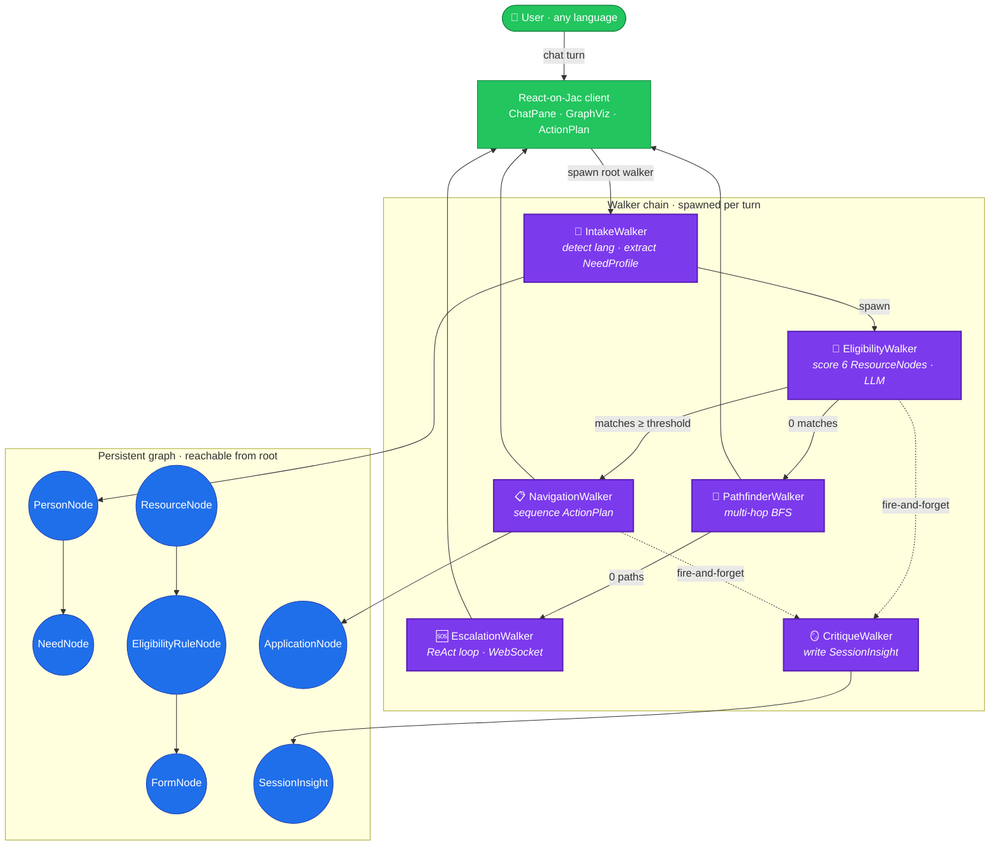
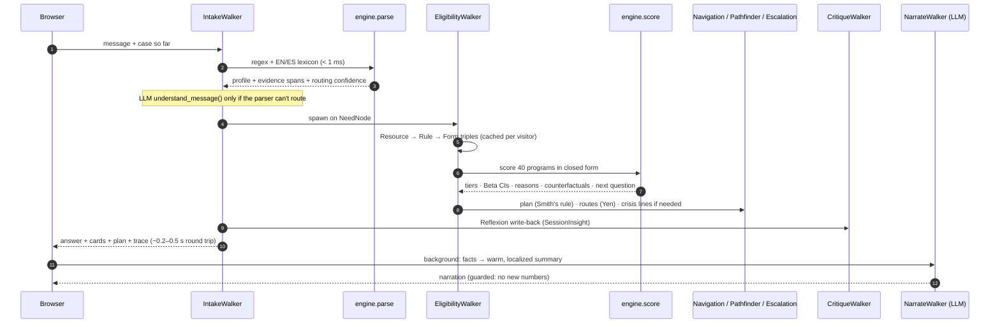
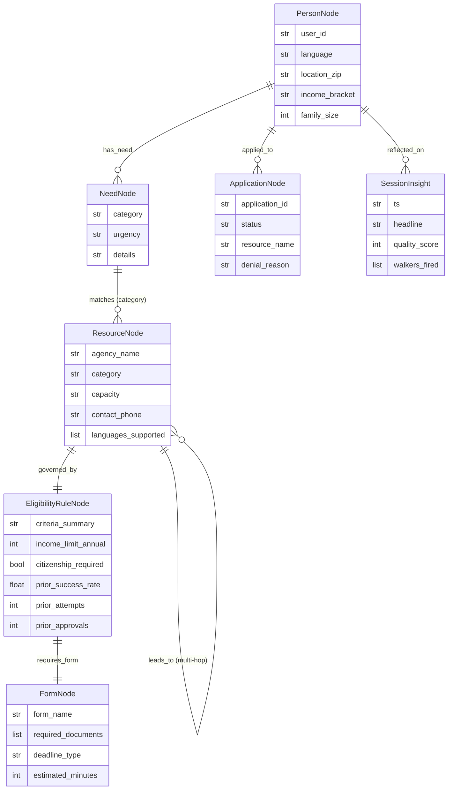

<div align="center">

# CivicMesh

### A multi-agent AI navigator that routes people in crisis to the housing, food, healthcare, and legal aid they qualify for — in any language, in under a minute.

[](https://devpost.com/software/civicmesh-0ctxl5)
[](https://devpost.com/software/civicmesh-0ctxl5)

[](https://huggingface.co/spaces/Anbu-00001/CivicMesh)
[](https://devpost.com/software/civicmesh-0ctxl5)
[](https://github.com/Jaseci-Labs/jaclang)
[](https://jaseci.org)
[](https://github.com/Jaseci-Labs/byllm)
[](https://build.nvidia.com)
[](./LICENSE)

</div>

> ## 🏆 JacHacks Spring 2026 — Double Winner
>
> - **🥇 1st Place — Agentic AI Track**
> - **🏆 Best Startup Idea**
>
> [View the Devpost submission →](https://devpost.com/software/civicmesh-0ctxl5) · [Try the live demo →](https://huggingface.co/spaces/Anbu-00001/CivicMesh)

---

## The problem

Tens of millions of vulnerable people — single mothers, undocumented families, elderly tenants on fixed incomes — do not know which programs they qualify for, what documents they need, or which agency to call first. The safety net is real, but it is buried behind fragmented websites, English-only intake forms, and screening logic that takes a caseworker to decode.

CivicMesh is a **graph-native multi-agent navigator** built on Jac. One sentence in English or Spanish → a ranked, explainable, eligibility-checked action plan in **a few hundred milliseconds**, with **phone numbers up front** and a plain-language reason for every recommendation.

---

## What makes it different

**Math first, LLM last.** Every decision a caseworker would need to defend — who qualifies, why, what to do first — is computed in closed form over the graph in about a millisecond. The model is used once per turn, off the critical path, only to phrase the answer warmly in the user's language.

| | Feature | What it does |
|---|---|---|
| ⚖️ | **Explainable, calibrated eligibility** (`engine/score.jac`) | Hard gates (citizenship, age) × weighted soft criteria (logistic income threshold, residency, household, curated situation targets). Every criterion is reported met / unmet / unknown with a reason. Thin evidence triggers **calibrated abstention** ("needs info") instead of a confident guess, and every near-miss gets a **counterfactual** ("you'd qualify if yearly income were ≤ $30,000 — you're $2,400 over"). |
| ❓ | **Value-of-information follow-ups** | Instead of a form, the agent asks the *one* question whose answer moves the most matches ("affects 6 matches"), with quick replies. Answers fold into the same case across turns. |
| 📈 | **Bayesian outcome learning** | Approval odds are a Beta-Binomial posterior (capacity-informed prior, 90% credible interval, UCB exploration bonus for ranking). Marking a real application approved/denied in the Action Plan tab updates the posterior and re-ranks future matches. |
| 🧭 | **Expected-cost routes** (`engine/paths.jac`) | Yen's k-shortest loopless paths (Dijkstra inside) over typed `leads_to` edges, with cost = days + λ·difficulty − μ·ln P(next program says yes). A super-source/super-sink turns "from anything I can start today to anything worth reaching" into one search. |
| 🗓️ | **Plan sequencing** (`engine/plan.jac`) | Steps ordered by Smith's weighted-shortest-processing-time rule (value ÷ effort, crisis lines pinned first); documents shared across steps are gathered once. |
| ⚡ | **Instant answer, narrated in the background** | The deterministic answer renders immediately; `NarrateWalker` makes the turn's single LLM call afterwards and is guarded against inventing phone numbers or facts. Every turn ships OpenTelemetry-shaped spans, rendered as a latency waterfall. |

---

## Architecture


```mermaid
flowchart TD
    User([👤 User · any language])
    Client[React-on-Jac client<br/>ChatPane · GraphViz · ActionPlan]

    User -->|chat turn| Client
    Client -->|spawn root walker| Intake

    subgraph Pipeline ["Walker chain · spawned per turn"]
        direction TB
        Intake[🚪 IntakeWalker<br/><i>detect lang · extract NeedProfile</i>]
        Elig[🎯 EligibilityWalker<br/><i>score 6 ResourceNodes · LLM</i>]
        Nav[📋 NavigationWalker<br/><i>sequence ActionPlan</i>]
        Path[🧭 PathfinderWalker<br/><i>multi-hop BFS</i>]
        Esc[🆘 EscalationWalker<br/><i>ReAct loop · WebSocket</i>]
        Crit[🪞 CritiqueWalker<br/><i>write SessionInsight</i>]
    end

    Intake -->|spawn| Elig
    Elig -->|matches ≥ threshold| Nav
    Elig -->|0 matches| Path
    Path -->|0 paths| Esc
    Elig -.->|fire-and-forget| Crit
    Nav -.->|fire-and-forget| Crit

    subgraph Graph ["Persistent graph · reachable from root"]
        direction LR
        Person((PersonNode))
        Need((NeedNode))
        Resource((ResourceNode))
        Rule((EligibilityRuleNode))
        Form((FormNode))
        App((ApplicationNode))
        Insight((SessionInsight))
    end

    Intake --> Person
    Person --> Need
    Resource --> Rule
    Rule --> Form
    Nav --> App
    Crit --> Insight

    Nav --> Client
    Path --> Client
    Esc --> Client

    classDef walker fill:#7c3aed,stroke:#5b21b6,color:#fff,stroke-width:2px
    classDef nodecls fill:#1f6feb,stroke:#1e40af,color:#fff
    classDef ui fill:#22c55e,stroke:#15803d,color:#fff
    class Intake,Elig,Nav,Path,Esc,Crit walker
    class Person,Need,Resource,Rule,Form,App,Insight nodecls
    class Client,User ui
```

The chain is **lazy-branching**: EligibilityWalker only spawns NavigationWalker if matches exist, only spawns PathfinderWalker on a dead end, and only spawns EscalationWalker if Pathfinder also fails. CritiqueWalker fires at the end regardless — the post-turn self-reflection is mandatory.

---

## Walker path · one turn


```mermaid
sequenceDiagram
    autonumber
    participant U as Browser
    participant I as IntakeWalker
    participant P as engine.parse
    participant E as EligibilityWalker
    participant S as engine.score
    participant N as Navigation / Pathfinder / Escalation
    participant C as CritiqueWalker
    participant L as NarrateWalker (LLM)

    U->>I: message + case so far
    I->>P: regex + EN/ES lexicon (< 1 ms)
    P-->>I: profile + evidence spans + routing confidence
    Note over I: LLM understand_message() only if the parser can't route
    I->>E: spawn on NeedNode
    E->>E: Resource → Rule → Form triples (cached per visitor)
    E->>S: score 40 programs in closed form
    S-->>E: tiers · Beta CIs · reasons · counterfactuals · next question
    E->>N: plan (Smith's rule) · routes (Yen) · crisis lines if needed
    I->>C: Reflexion write-back (SessionInsight)
    I-->>U: answer + cards + plan + trace (~0.2–0.5 s round trip)
    U->>L: background: facts → warm, localized summary
    L-->>U: narration (guarded: no new numbers)
```

---

## Graph schema

Every node and edge ships with a `sem` semstring; byllm reads those strings as grounding when generating structured output, so the schema *is* the prompt context.


```mermaid
erDiagram
    PersonNode ||--o{ NeedNode : "has_need"
    PersonNode ||--o{ ApplicationNode : "applied_to"
    PersonNode ||--o{ SessionInsight : "reflected_on"
    NeedNode ||--o{ ResourceNode : "matches (category)"
    ResourceNode ||--|| EligibilityRuleNode : "governed_by"
    EligibilityRuleNode ||--|| FormNode : "requires_form"
    ResourceNode ||--o{ ResourceNode : "leads_to (multi-hop)"

    PersonNode {
        str user_id
        str language
        str location_zip
        str income_bracket
        int family_size
    }
    NeedNode {
        str category
        str urgency
        str details
    }
    ResourceNode {
        str agency_name
        str category
        str capacity
        str contact_phone
        list languages_supported
    }
    EligibilityRuleNode {
        str criteria_summary
        int income_limit_annual
        bool citizenship_required
        float prior_success_rate
        int prior_attempts
        int prior_approvals
    }
    FormNode {
        str form_name
        list required_documents
        str deadline_type
        int estimated_minutes
    }
    ApplicationNode {
        str application_id
        str status
        str resource_name
        str denial_reason
    }
    SessionInsight {
        str ts
        str headline
        int quality_score
        list walkers_fired
    }
```

---

## Escape routes · Pathfinder

The civic safety net is a graph: shelter intake files a re-housing referral, SNAP intake pre-qualifies WIC. `PathfinderWalker` reads the typed `leads_to` edges (days, difficulty, reason) straight off the graph and runs **Yen's k-shortest loopless paths** from every program the user can start today to every program worth reaching:

```
cost(u → v) = days(u→v) + λ · difficulty(u→v) + μ · (−ln P(v says yes))      λ = 10, μ = 30
P(v says yes) = P(eligible) × E[approval | Beta posterior]
```

A fast hop into a program that will probably reject you costs more than a slower, surer one. Costs are non-negative (−ln p ≥ 0), so Dijkstra stays exact; a virtual super-source and super-sink make it a single k-shortest search. V≈40, E≈26: well under a millisecond.

---

## Outcome learning · the graph gets smarter

Approval odds on every card are a **Beta-Binomial posterior**. The prior comes from capacity (open programs `Beta(6,3)`, waitlists `Beta(3,5)`); each real outcome recorded in the Action Plan tab (`Approved` / `Denied`) walks back to the gating `EligibilityRuleNode` and updates it:

```
a = prior_a + approvals        b = prior_b + denials
mean = a / (a+b)      90% CI ≈ mean ± 1.645·sd      rank bonus = UCB₈₀ = mean + 1.28·sd
```

The UI shows the move ("approval odds 38% → 44%, 1 real outcome"), and future rankings use it. Wide intervals on untested programs earn an exploration bonus, so the agent doesn't only ever recommend the well-trodden options.

---

## Reflexion · the agent critiques itself

After every turn, `CritiqueWalker` writes a `SessionInsight` node (quality score, what fired, top match) on a `reflected_on` edge — zero LLM calls. The Telemetry tab charts `quality_score` over time. (Reading those insights back into prompts was removed: it polluted category detection.)

---

## Multi-language UX

English and Spanish are understood **without an LLM**: the parser carries bilingual lexicons and patterns ("gano $1,400 al mes", "somos 4", "no hemos comido", "sin papeles"), and replies, plan steps, follow-up questions and quick replies are composed in the user's language. For any other language the one LLM call (`understand_message`) routes the need, and `NarrateWalker` localizes the reply and chips in the background.

---

## Jac features showcased

- **Walkers with abilities keyed by node type.** Each walker declares `with PersonNode entry`, `with NeedNode entry`, `with ResourceNode entry`, so node-specific logic stays at the node boundary.
- **Typed edges with payload.** `leads_to`, `applied_to`, `governed_by`, `reflected_on`, `has_need` — all carry typed `has` fields (transition_reason, difficulty, status, ts).
- **Edge-filter traversal expressions.** `[root --> [?:PersonNode, user_id == self.user_id]]` and chained walks like `[resource ->:governed_by:-> [?:EligibilityRuleNode]]` express multi-hop joins in one line.
- **byllm Meaning-Typed Programming, used sparingly.** Two typed stubs (`understand_message → UnderstoodNeed`, `narrate_turn → Narration`) with `sem` strings as the prompt; a litellm fallback pool (Groq → NIM) with tight timeouts and no retries.
- **`sem` strings everywhere.** Every node, edge, walker field, and stub parameter ships a semstring — byllm uses these as the entire prompt context, so the schema *is* the system prompt.
- **jac-scale auto REST.** Every walker is an HTTP endpoint with zero FastAPI glue; the client calls them with `root spawn` / `jacSpawn`.
- **Root-reachable session persistence.** Sessions live as subgraphs reachable from `root`; a browser refresh reloads the user's full conversation, plan, and applications with zero database calls.
- **`spawn` chaining with `.summary` mirroring.** Child walkers mirror their final `report` payload to `.summary` so the parent walker can read it back — because `report` only bubbles to the outermost walker's stream.

---

## Performance & evaluation

| | Before (LLM per step) | After (math-first) |
|---|---|---|
| Chat turn, live HF Space (cpu-basic) | 60+ s (Spanish sample: 62.6 s server, then client-side translation calls) | answer on screen ~1 s after the click; server time 60–200 ms (measured 2026-09-27 from a client with ~1.1 s baseline RTT to the Space) |
| LLM calls on the critical path | 7–15 sequential | 0 (1 only if the parser can't route the message) |
| LLM narration | inline, blocking | async, 2.7–3.1 s server-side on NIM mistral-nemotron, guarded against invented numbers |
| Engine time per turn | — | p50 0.75 ms · p95 1.1 ms (golden set, in-process) |
| Round trip, local container | — | p50 ~0.2–0.3 s |

Golden-set regression gate (`tests/golden.json`, 36 hand-written EN/ES cases):

```
cd civicmesh && jac run tests/eval_engine.jac
  field accuracy 100% (116/116) · top-3 hit rate 100% (33/33) · exclusion errors 0
```

The golden set was written alongside the engine, so treat it as a regression gate rather than an independent benchmark.

---

## Quick start

**Prerequisites:** Python 3.12 · an [NVIDIA NIM](https://build.nvidia.com) API key (free tier works).

```bash
git clone https://github.com/Anbu-00001/CivicMesh.git
cd CivicMesh

python3.12 -m venv venv
source venv/bin/activate
pip install -r requirements.txt

cp .env.example .env
# paste your NVIDIA NIM key into .env
export NVIDIA_NIM_API_KEY=nvapi-...

cd civicmesh
jac serve app.jac
```

Then open **http://localhost:8000/cl/app** in a browser. The dev server binds `:8000` for the React client and `:8001` for the REST + WebSocket API. OpenAPI docs at `:8001/docs`.

### Try it

| Prompt | What fires |
|---|---|
| *"I'm a single mom, need help with rent, two kids"* | Intake → Eligibility → **Navigation** (action plan) |
| *"Necesito un refugio esta noche"* | Intake (es) → Eligibility → Navigation in Spanish |
| *"Who do I call for a domestic-violence safe house?"* | Intake → Eligibility → Navigation with **1-800-799-7233** up front |
| *"I'm being evicted tomorrow, nothing has worked"* | Intake → Eligibility (0 matches) → **Pathfinder** (multi-hop escape) |

---

## Environment variables

| Name | Required | Description |
|---|---|---|
| `NVIDIA_NIM_API_KEY` | yes | byllm key for the NVIDIA NIM model chain (default primary `mistralai/mistral-nemotron`) |
| `CIVICMESH_LLM_MODELS` | no | Comma-separated litellm model ids tried in order, e.g. `nvidia_nim/mistralai/mistral-nemotron,nvidia_nim/openai/gpt-oss-20b`. Overrides the default chain in `llm/stubs.jac` |
| `CIVICMESH_DEMO_MODE` | no | `1` skips per-resource LLM eligibility scoring (deterministic, fast) |
| `FEATHERLESS_API_KEY` | no | Optional fallback provider |
| `JAC_SCALE_HOST` | no | API bind host. Default `127.0.0.1` |
| `JAC_SCALE_PORT` | no | API port. Default `8001` |
| `JAC_CLIENT_PORT` | no | React client port. Default `8000` |
| `CIVICMESH_LOG_LEVEL` | no | `debug` · `info` · `warn` · `error` |

---

## Project structure

```
CivicMesh/
├── civicmesh/
│   ├── app.jac                # entry point, exposes walkers as endpoints
│   ├── app.sv.jac             # server-side bindings
│   ├── frontend.cl.jac        # React client shell + routing
│   ├── frontend.impl.jac      # client implementation
│   ├── walkers/
│   │   ├── intake.jac         # language detect · NeedProfile extract · Reflexion read
│   │   ├── eligibility.jac    # score 6 ResourceNodes · outcome-learning blend
│   │   ├── navigation.jac     # ActionPlan generation · ApplicationNode persist
│   │   ├── pathfinder.jac     # multi-hop BFS over leads_to edges
│   │   ├── escalation.jac     # ReAct loop · WebSocket streaming
│   │   ├── critique.jac       # Reflexion write · SessionInsight headline
│   │   ├── memory.jac         # read_session · update_status · prior backfill
│   │   ├── translate.jac      # batched translation with session cache
│   │   ├── impact.jac         # aggregate dashboard stats
│   │   ├── live_telemetry.jac # real-time walker-event stream
│   │   └── seed.jac           # idempotent graph seeding + migration sweep
│   ├── components/
│   │   ├── ChatPane.{cl,impl}.jac
│   │   ├── ActionPlan.{cl,impl}.jac
│   │   ├── GraphViz.{cl,impl}.jac
│   │   ├── ImpactReport.{cl,impl}.jac
│   │   ├── TelemetryPanel.{cl,impl}.jac
│   │   ├── LandingPage.{cl,impl}.jac
│   │   └── SessionBanner.cl.jac
│   ├── llm/
│   │   └── stubs.jac          # byllm ability declarations + sem strings
│   ├── graph/
│   │   ├── nodes.jac          # PersonNode · NeedNode · ResourceNode · ...
│   │   ├── edges.jac          # has_need · governed_by · leads_to · reflected_on
│   │   └── seed_data.jac      # demo seed wiring
│   ├── data/
│   │   └── resources.json     # 40 curated US safety-net programs
│   ├── tests/
│   └── jac.toml
├── docs/
│   ├── DEMO_SCRIPT.md         # 3-min judge walkthrough
│   └── DEVPOST_WRITEUP.md     # full DevPost narrative
├── assets/                    # screenshots, badges
├── requirements.txt
├── .env.example
├── .gitignore
├── LICENSE
└── README.md
```

---

## License

MIT. See [LICENSE](./LICENSE).

---

<div align="center">

**Built for JacHacks Spring 2026** · *the safety net is real, it just needs a router*

</div>
