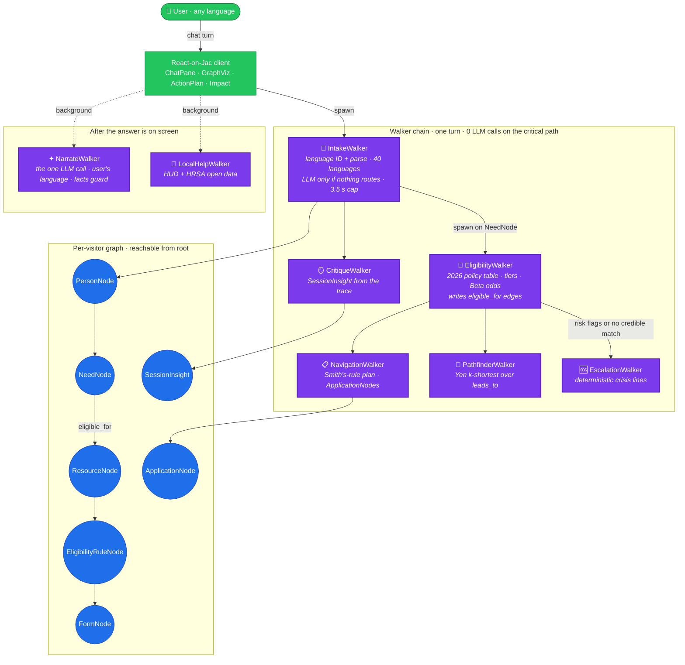
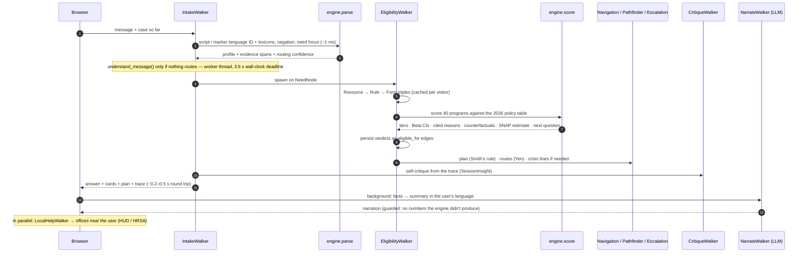
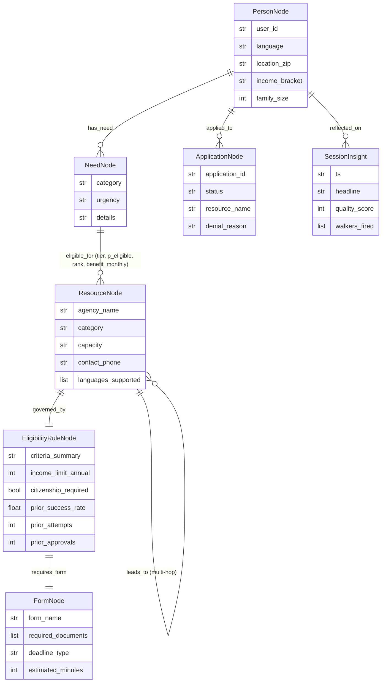

<div align="center">

# CivicMesh

### A multi-agent navigator that routes people in crisis to the housing, food, healthcare and legal aid they qualify for — answered in under a second, in 40 languages, against 2026 federal rules.

[](https://devpost.com/software/civicmesh-0ctxl5)
[](https://devpost.com/software/civicmesh-0ctxl5)

[](https://huggingface.co/spaces/Anbu-00001/CivicMesh)
[](https://devpost.com/software/civicmesh-0ctxl5)
[](https://github.com/Jaseci-Labs/jaclang)
[](https://jaseci.org)
[](https://github.com/Jaseci-Labs/byllm)
[](https://build.nvidia.com)
[](#routing-robustness--hard-tests)
[](./LICENSE)

</div>

> ## 🏆 JacHacks Spring 2026 — Double Winner
>
> - **🥇 1st Place — Agentic AI Track**
> - **🏆 Best Startup Idea**
>
> [View the Devpost submission →](https://devpost.com/software/civicmesh-0ctxl5) · [Try the live demo →](https://huggingface.co/spaces/Anbu-00001/CivicMesh)

---

## The problem

Tens of millions of vulnerable people — single mothers, undocumented families, elderly tenants on fixed incomes — do not know which programs they qualify for, what documents they need, or which agency to call first. The safety net is real, but it is buried behind fragmented websites, English-only intake forms, and screening logic that takes a caseworker to decode.

CivicMesh is a **graph-native multi-agent navigator** built on Jac. One sentence in any of **40 languages** → a ranked, explainable action plan checked against **2026 federal eligibility rules for that household**, in **a few hundred milliseconds**, with **phone numbers up front** (including real local offices from HUD and HRSA open data) and a plain-language reason for every recommendation.

---

## What makes it different

**Math first, LLM last.** Every decision a caseworker would need to defend — who qualifies, why, what to do first — is computed in closed form over the graph in about a millisecond. The model is used once per turn, off the critical path, only to phrase the answer warmly in the user's language.

| | Feature | What it does |
|---|---|---|
| 🌐 | **40 languages without an LLM** (`engine/i18n.jac`) | Script identification (Tamil, Telugu, Bengali, Hangul, Kana, Ethiopic, Arabic-script Urdu/Persian/Arabic, Cyrillic Ukrainian/Russian, …) + distinctive-word scoring for Latin scripts (Vietnamese, Tagalog, Haitian Creole, Portuguese, Hmong, romanized Hindi/Tamil, …) + a routing lexicon per language. The answer is instant; the one LLM call then writes a summary in the user's own language. Anything outside the lexicon still works: a time-boxed (3.5 s) LLM read routes it and the narrator mirrors the user's language. |
| 📜 | **Effective-dated 2026 policy table** (`engine/policy.jac`) | Income limits are computed per household, not hardcoded: % of the **2026 HHS poverty guidelines** (AK/HI tables), **HUD FY2026 area median income** with HUD's household-size adjustments, **state Medicaid expansion** status, and the **P.L. 119-21** immigrant-eligibility changes (SNAP since 2025-07-04, Medicaid/CHIP from 2026-10-01 — the card warns before the date and flips after it). SNAP shows a **benefit estimate** from USDA's FY2026 formula. Every criterion cites its source. |
| ⚖️ | **Explainable, calibrated eligibility** (`engine/score.jac`) | Hard gates (status, age, coverage rules, season) × weighted soft criteria (logistic income threshold against the policy limit, residency, household, curated situation targets), capped at 97% — never "certain". Unknown ≠ fail: thin evidence triggers **calibrated abstention** ("needs info"), and near-misses get a **counterfactual** ("you'd qualify with a household of 4 or more"). Ranking is expected-value aware (SNAP ranks by what it's worth to this household). |
| ❓ | **Value-of-information follow-ups** | Instead of a form, the agent asks the *one* question whose answer moves the most matches ("affects 6 matches"), with quick replies. Answers fold into the same case across turns. |
| 📈 | **Bayesian outcome learning** | Approval odds are a Beta-Binomial posterior (capacity-informed prior, 90% credible interval, UCB exploration bonus for ranking). Marking a real application approved/denied in the Action Plan tab updates the posterior and re-ranks future matches. |
| 🧭 | **Expected-cost routes** (`engine/paths.jac`) | Yen's k-shortest loopless paths (Dijkstra inside) over typed `leads_to` edges, with cost = days + λ·difficulty − μ·ln P(next program says yes). A super-source/super-sink turns "from anything I can start today to anything worth reaching" into one search. |
| 🗓️ | **Plan sequencing** (`engine/plan.jac`) | Steps ordered by Smith's weighted-shortest-processing-time rule (value ÷ effort, crisis lines pinned first); documents shared across steps are gathered once. |
| ⚡ | **Instant answer, narrated in the background** | The deterministic answer renders immediately; `NarrateWalker` makes the turn's single LLM call afterwards. A facts guard voids any narration containing a number the engine didn't produce (phone-length numbers must come from the engine, so a prompt-injected "call 555-…" can't be echoed). Every turn ships OpenTelemetry-shaped spans, rendered as a latency waterfall. |
| 📍 | **Real local offices** (`walkers/local_help.jac`) | After the answer, the client asks for offices near the user's city/state from keyless federal open data: **HUD Public Housing Authorities** (3,776), **HUD-approved housing counselors** (4,767) and **HRSA health center sites** — names, phones, addresses, voucher counts, opening hours. Parallel, 4 s timeouts, 6 h cache, input sanitized. |
| 🕸️ | **The graph tab is a query, not a drawing** | Each verdict is persisted as a scored `eligible_for` edge (tier, P(eligible), rank, benefit). `GraphSnapshotWalker` returns the visitor's real subgraph — person → latest need → programs → rules → forms, applications, `leads_to` routes, self-critiques — and Replay walks it in pipeline order. |

---

## Architecture


```mermaid
flowchart TD
    User([👤 User · any language])
    Client[React-on-Jac client<br/>ChatPane · GraphViz · ActionPlan · Impact]

    User -->|chat turn| Client
    Client -->|spawn| Intake

    subgraph Pipeline ["Walker chain · one turn · 0 LLM calls on the critical path"]
        direction TB
        Intake[🚪 IntakeWalker<br/><i>language ID + parse · 40 languages<br/>LLM only if nothing routes · 3.5 s cap</i>]
        Elig[🎯 EligibilityWalker<br/><i>2026 policy table · tiers · Beta odds<br/>writes eligible_for edges</i>]
        Nav[📋 NavigationWalker<br/><i>Smith's-rule plan · ApplicationNodes</i>]
        Path[🧭 PathfinderWalker<br/><i>Yen k-shortest over leads_to</i>]
        Esc[🆘 EscalationWalker<br/><i>deterministic crisis lines</i>]
        Crit[🪞 CritiqueWalker<br/><i>SessionInsight from the trace</i>]
    end

    subgraph Async ["After the answer is on screen"]
        direction TB
        Narr[✦ NarrateWalker<br/><i>the one LLM call · user's language · facts guard</i>]
        Local[📍 LocalHelpWalker<br/><i>HUD + HRSA open data</i>]
    end

    Intake -->|spawn on NeedNode| Elig
    Elig --> Nav
    Elig --> Path
    Elig -->|risk flags or no credible match| Esc
    Intake --> Crit
    Client -.->|background| Narr
    Client -.->|background| Local

    subgraph Graph ["Per-visitor graph · reachable from root"]
        direction LR
        Person((PersonNode))
        Need((NeedNode))
        Resource((ResourceNode))
        Rule((EligibilityRuleNode))
        Form((FormNode))
        App((ApplicationNode))
        Insight((SessionInsight))
    end

    Intake --> Person
    Person --> Need
    Need -->|eligible_for| Resource
    Resource --> Rule
    Rule --> Form
    Nav --> App
    Crit --> Insight

    classDef walker fill:#7c3aed,stroke:#5b21b6,color:#fff,stroke-width:2px
    classDef nodecls fill:#1f6feb,stroke:#1e40af,color:#fff
    classDef ui fill:#22c55e,stroke:#15803d,color:#fff
    class Intake,Elig,Nav,Path,Esc,Crit,Narr,Local walker
    class Person,Need,Resource,Rule,Form,App,Insight nodecls
    class Client,User ui
```

Everything in the chain is deterministic; the only model call per turn (`NarrateWalker`) happens after the answer is already on screen. EscalationWalker runs when the message shows risk (self-harm, domestic violence — flags that negation can never cancel) or when nothing credible matched; its crisis lines never wait on a model.

---

## Walker path · one turn


```mermaid
sequenceDiagram
    autonumber
    participant U as Browser
    participant I as IntakeWalker
    participant P as engine.parse
    participant E as EligibilityWalker
    participant S as engine.score
    participant N as Navigation / Pathfinder / Escalation
    participant C as CritiqueWalker
    participant L as NarrateWalker (LLM)

    U->>I: message + case so far
    I->>P: script / marker language ID + lexicons, negation, need focus (~1 ms)
    P-->>I: profile + evidence spans + routing confidence
    Note over I: understand_message() only if nothing routes — worker thread, 3.5 s wall-clock deadline
    I->>E: spawn on NeedNode
    E->>E: Resource → Rule → Form triples (cached per visitor)
    E->>S: score 40 programs against the 2026 policy table
    S-->>E: tiers · Beta CIs · cited reasons · counterfactuals · SNAP estimate · next question
    E->>E: persist verdicts as eligible_for edges
    E->>N: plan (Smith's rule) · routes (Yen) · crisis lines if needed
    I->>C: self-critique from the trace (SessionInsight)
    I-->>U: answer + cards + plan + trace (~0.2–0.5 s round trip)
    U->>L: background: facts → summary in the user's language
    L-->>U: narration (guarded: no numbers the engine didn't produce)
    Note over U: in parallel: LocalHelpWalker → offices near the user (HUD / HRSA)
```

---

## Graph schema

Every node and edge ships with a `sem` semstring; byllm reads those strings as grounding when generating structured output, so the schema *is* the prompt context.


```mermaid
erDiagram
    PersonNode ||--o{ NeedNode : "has_need"
    PersonNode ||--o{ ApplicationNode : "applied_to"
    PersonNode ||--o{ SessionInsight : "reflected_on"
    NeedNode ||--o{ ResourceNode : "eligible_for (tier, p_eligible, rank, benefit_monthly)"
    ResourceNode ||--|| EligibilityRuleNode : "governed_by"
    EligibilityRuleNode ||--|| FormNode : "requires_form"
    ResourceNode ||--o{ ResourceNode : "leads_to (multi-hop)"

    PersonNode {
        str user_id
        str language
        str location_zip
        str income_bracket
        int family_size
    }
    NeedNode {
        str category
        str urgency
        str details
    }
    ResourceNode {
        str agency_name
        str category
        str capacity
        str contact_phone
        list languages_supported
    }
    EligibilityRuleNode {
        str criteria_summary
        int income_limit_annual
        bool citizenship_required
        float prior_success_rate
        int prior_attempts
        int prior_approvals
    }
    FormNode {
        str form_name
        list required_documents
        str deadline_type
        int estimated_minutes
    }
    ApplicationNode {
        str application_id
        str status
        str resource_name
        str denial_reason
    }
    SessionInsight {
        str ts
        str headline
        int quality_score
        list walkers_fired
    }
```

---

## Escape routes · Pathfinder

The civic safety net is a graph: shelter intake files a re-housing referral, SNAP intake pre-qualifies WIC. `PathfinderWalker` reads the typed `leads_to` edges (days, difficulty, reason) straight off the graph and runs **Yen's k-shortest loopless paths** from every program the user can start today to every program worth reaching:

```
cost(u → v) = days(u→v) + λ · difficulty(u→v) + μ · (−ln P(v says yes))      λ = 10, μ = 30
P(v says yes) = P(eligible) × E[approval | Beta posterior]
```

A fast hop into a program that will probably reject you costs more than a slower, surer one. Costs are non-negative (−ln p ≥ 0), so Dijkstra stays exact; a virtual super-source and super-sink make it a single k-shortest search. V≈40, E≈26: well under a millisecond.

---

## Outcome learning · the graph gets smarter

Approval odds on every card are a **Beta-Binomial posterior**. The prior comes from capacity (open programs `Beta(6,3)`, waitlists `Beta(3,5)`); each real outcome recorded in the Action Plan tab (`Approved` / `Denied`) walks back to the gating `EligibilityRuleNode` and updates it:

```
a = prior_a + approvals        b = prior_b + denials
mean = a / (a+b)      90% CI ≈ mean ± 1.645·sd      rank bonus = UCB₈₀ = mean + 1.28·sd
```

The UI shows the move ("approval odds 38% → 44%, 1 real outcome"), and future rankings use it. Wide intervals on untested programs earn an exploration bonus, so the agent doesn't only ever recommend the well-trodden options.

---

## Self-critique

After every turn, `CritiqueWalker` writes a `SessionInsight` node on a `reflected_on` edge: a quality score, the walkers that actually ran and the LLM calls actually made — both read off the turn's trace, not estimated. The Telemetry tab charts them. (Feeding insights back into routing was tried and removed: it polluted category detection.)

---

## Languages

Routing needs no model in **40 languages**: English, Spanish, and the languages spoken most in U.S. homes after them (Census ACS table S1601) — Chinese, Tagalog, Vietnamese, Arabic, French, Korean, Russian, Haitian Creole, German, Hindi, Portuguese, Italian, Polish, Urdu, Persian, Japanese, Gujarati, Telugu, Bengali, Tamil, Punjabi, Ukrainian, Greek, Armenian, Hebrew, Amharic, Somali, Nepali, Thai, Khmer, Hmong, Burmese, Swahili, Malayalam, Kannada, Marathi, Turkish, Indonesian — plus romanized Hindi and Tamil.

- **Script first.** A non-Latin script names the language; shared scripts are split by letters only one language uses (Urdu ٹ ڈ ڑ ں ے vs Persian پ چ ژ گ vs Arabic; Ukrainian і ї є ґ vs Russian; Kana → Japanese, Han-only → Chinese; Nepali छैन / मलाई vs Marathi आहे / नाही).
- **Latin scripts** are scored by distinctive function words and letters (Vietnamese ơ ư đ + tone marks — but not Yoruba's dot-below vowels; Turkish ı ğ ş; Polish ł ą ę; Portuguese ã õ). One stray marker in a long sentence is not evidence: the language is left unidentified instead of guessed.
- **Meaning, not keywords.** Negation and possession cancel a keyword ("we're not homeless", "I don't need a lawyer", "we have food", "no necesito comida", "我不需要食物", "खाना नहीं चाहिए") while lacking something stays a need ("no food", "haven't eaten", "no tengo casa", "我没有食物"); "…but they ran out" undoes possession. The thing asked for outweighs context ("the shelter gave us a bed, now I need a doctor" → healthcare). Generic "home" words (घर, வீடு, بيت, bahay) are weak evidence, so "no food at home" stays food.
- **Everything else.** Messages outside the lexicon get a 3.5 s time-boxed LLM read; the narrator writes back in whatever language the user used. Messages with no signal at all (empty, emoji, a bare number) get a "what do you need help with?" question with four quick replies instead of a guess.

---

## Eligibility rules · 2026 policy table

`engine/policy.jac` holds the numbers, their effective dates and their sources; `engine/score.jac` applies them to the household described.

| Rule | Value | Source |
|---|---|---|
| Poverty guideline | $15,960 + $5,680 per person (AK $19,950 + $7,100 · HI $18,360 + $6,530) | HHS 2026 poverty guidelines, Federal Register 2026-01-15 |
| Area median income | U.S. median family income $107,900; size adjustments 70/80/90/100/108/116/124/132% | HUD FY2026 Section 8 income limits (effective 2026-05-01) |
| Program limits | SNAP 130% · WIC 185% · school meals 130/185% · CSFP 150% · LIHEAP 150% · Medicaid expansion 138% · LSC legal aid 125% · Section 8 50% AMI · public housing 80% AMI | program rules; locally-set limits are labelled "typical" |
| Medicaid expansion | not expanded: AL FL GA KS MS SC TN TX WI WY (WI covers adults to 100%) — childless adults in the others are blocked with the reason and pointed to health centers / the Marketplace | KFF, Status of State Medicaid Expansion Decisions |
| Immigrant eligibility | SNAP: citizens, green-card holders, Cuban/Haitian entrants, COFA citizens (refugees/asylees/parolees out since 2025-07-04). Medicaid/CHIP: same from 2026-10-01 | P.L. 119-21 §10108, §71109; USDA/FNS memo 2025-12-09 |
| SNAP estimate | max allotment − 30% of net income (20% earnings + standard deduction); FY2026 max $994 for 4 | USDA FNS FY2026 allotments and deductions |
| Seasonal | Summer Food Service Program runs June–August | USDA SFSP |

Unknown household size? The limit is shown for one person with the per-person increment, and a household that might qualify is "needs info" — not ruled out. The FY2027 SNAP amounts (effective 2026-10-01) are not encoded yet.

---

## Jac features showcased

- **Walkers with abilities keyed by node type.** Each walker declares `with PersonNode entry`, `with NeedNode entry`, `with ResourceNode entry`, so node-specific logic stays at the node boundary.
- **Typed edges with payload.** `leads_to`, `applied_to`, `governed_by`, `reflected_on`, `has_need` — all carry typed `has` fields (transition_reason, difficulty, status, ts).
- **Edge-filter traversal expressions.** `[root --> [?:PersonNode, user_id == self.user_id]]` and chained walks like `[resource ->:governed_by:-> [?:EligibilityRuleNode]]` express multi-hop joins in one line.
- **byllm Meaning-Typed Programming, used sparingly.** Two typed stubs (`understand_message → UnderstoodNeed`, `narrate_turn → Narration`) with `sem` strings as the prompt; a litellm fallback pool (Groq → NIM). Retries are off at both layers — the Router's and the provider SDK's (pinned per deployment, since litellm's OpenAI handler otherwise retries twice after every timeout) — and the routing call runs under a walker-owned wall-clock deadline.
- **`sem` strings everywhere.** Every node, edge, walker field, and stub parameter ships a semstring — byllm uses these as the entire prompt context, so the schema *is* the system prompt.
- **jac-scale auto REST.** Every walker is an HTTP endpoint with zero FastAPI glue; the client calls them with `root spawn` / `jacSpawn`.
- **Root-reachable session persistence.** Each browser gets an anonymous account and its own root; the case (needs, scored `eligible_for` verdicts, applications, self-critiques) is a subgraph under it, and the Graph tab reads it back with one walker.
- **`spawn` chaining with `.summary` mirroring.** Child walkers mirror their final `report` payload to `.summary` so the parent walker can read it back — because `report` only bubbles to the outermost walker's stream.

---

## Performance & evaluation

| | Before (LLM per step) | After (math-first) |
|---|---|---|
| Chat turn, live HF Space (cpu-basic) | 60+ s (Spanish sample: 62.6 s server, then client-side translation calls) | answer on screen ~1 s after the click; server time 60–200 ms (measured 2026-09-27 from a client with ~1.1 s baseline RTT to the Space) |
| Tamil / Hindi / Chinese message | 33 s (sync LLM routing + hidden SDK retries), English-only reply | routed deterministically: 0.25–0.5 s round trip in a local container, narration in the user's language afterwards (2.5–4.2 s measured live for ta/hi/zh/vi) |
| LLM calls on the critical path | 7–15 sequential | 0 (1 only if nothing routes, capped at 3.5 s) |
| LLM narration | inline, blocking | async, guarded against invented numbers |
| Engine time per turn | — | p50 ~1 ms · p95 ~3 ms (all suites, in-process) |

### Routing robustness · hard tests

`tests/eval_engine.jac` is the regression gate (non-zero exit below the floors). Four suites, 196 cases, 393 checks:

| Suite | Cases | What it covers |
|---|---|---|
| `golden.json` | 41 | EN/ES full pipeline: fields, top-3 programs, exclusions, and 5 policy cases (refugee + SNAP, Texas childless adult + Medicaid, California expansion, 130% FPL for 4, Alaska table) |
| `golden_i18n.json` | 55 | language ID + need routing in 38 more languages, crisis and DV phrasing, one out-of-lexicon language (Yoruba) that must stay unidentified |
| `golden_adversarial.json` | 60 | cross-category traps ("no food at home", "debt collectors about hospital bills"), negation, possession, idioms ("dying of hunger", "tooth is killing me"), code-switching, romanized scripts, no-signal input |
| `golden_holdout.json` | 40 | written *after* tuning on the adversarial set, then scored before any fix |

```
cd civicmesh && jac run tests/eval_engine.jac
  field accuracy 100% (393/393) · 40/40 languages · top-3 + plan checks 100% (54/54) · exclusion errors 0
```

Honest numbers: on first run the adversarial suite scored **74%** category accuracy and the held-out batch **78%** of checks. The held-out misses included two safety gaps — "I don't want to live anymore" raised no crisis flag, and two domestic-violence phrasings were missed — which were fixed first; crisis/violence flags can no longer be cancelled by negation. All suites were written by the same author as the engine, so they are regression gates, not an independent benchmark; native-speaker review of the lexicons is welcome.

An end-to-end script also drives a running server through multi-turn flows (Tamil yes/no replies, a refugee answering the status question, a language switch), hostile input (empty, 6,000 characters, `<script>`, SQL-shaped text, emoji, prompt injection) and every walker: 32/32 checks locally.

## Quick start

**Prerequisites:** Python 3.12 · an [NVIDIA NIM](https://build.nvidia.com) API key (free tier works).

```bash
git clone https://github.com/Anbu-00001/CivicMesh.git
cd CivicMesh

python3.12 -m venv venv
source venv/bin/activate
pip install -r requirements.txt

cp .env.example .env
# paste your NVIDIA NIM key into .env
export NVIDIA_NIM_API_KEY=nvapi-...

cd civicmesh
jac serve app.jac
```

Then open **http://localhost:8000/cl/app** in a browser. The dev server binds `:8000` for the React client and `:8001` for the REST + WebSocket API. OpenAPI docs at `:8001/docs`.

### Try it

| Prompt | What fires |
|---|---|
| *"I'm a single mom, need help with rent, two kids"* | Intake → Eligibility → **Navigation** (action plan) |
| *"Necesito un refugio esta noche"* | Intake (es) → Eligibility → Navigation in Spanish |
| *"Who do I call for a domestic-violence safe house?"* | Intake → Eligibility → Navigation with **1-800-799-7233** up front |
| *"I'm being evicted tomorrow, nothing has worked"* | Intake → Eligibility → Pathfinder routes + local housing authorities |
| *"இன்று நான் எங்கே உணவு பெறுவது? எனக்கு வேலை இல்லை."* | Tamil, routed without an LLM → food programs → summary in Tamil |
| *"I'm a refugee and we need food stamps, family of 3"* | SNAP explained as ineligible under P.L. 119-21; WIC / food banks instead |
| *"We are a family of 4, we earn $2,800 a month and need food"* | SNAP first, ≈ $389/mo estimate with the USDA arithmetic |

---

## Environment variables

| Name | Required | Description |
|---|---|---|
| `NVIDIA_NIM_API_KEY` | yes | byllm key for the NVIDIA NIM model chain (default primary `mistralai/mistral-nemotron`, fallback `openai/gpt-oss-20b`) |
| `GROQ_API_KEY` | no | When set, `groq/openai/gpt-oss-20b` leads the pool |
| `CIVICMESH_LLM_MODELS` | no | Comma-separated litellm model ids tried in order; overrides the default chain in `llm/stubs.jac` |
| `FEATHERLESS_API_KEY` | no | Optional last-resort fallback provider |
| `CIVICMESH_POLICY_DATE` | no | `YYYY-MM-DD` override for effective-dated rules (tests pin 2026-09-27) |
| `PORT` | no | Container port (Dockerfile default 7860) |

---

## Project structure

```
CivicMesh/
├── civicmesh/
│   ├── app.jac                # entry point, exposes walkers as endpoints
│   ├── app.sv.jac             # server-side bindings
│   ├── frontend.cl.jac        # React client shell + routing
│   ├── frontend.impl.jac      # client implementation
│   ├── engine/                # pure, deterministic, sub-millisecond
│   │   ├── i18n.jac           # language ID (scripts + markers), 40-language lexicons, negation, need focus
│   │   ├── parse.jac          # profile extraction with evidence spans
│   │   ├── policy.jac         # effective-dated 2026 rules: FPL, HUD AMI, Medicaid, P.L. 119-21, SNAP estimate
│   │   ├── score.jac          # tiers, Beta posteriors, counterfactuals, value of information
│   │   ├── plan.jac           # Smith's-rule plan + shared documents
│   │   ├── paths.jac          # Dijkstra + Yen k-shortest routes
│   │   ├── compose.jac        # multi-turn merge, reply text, OTel-shaped spans
│   │   └── stats.jac          # anonymous platform counters (since restart)
│   ├── walkers/
│   │   ├── intake.jac         # orchestrator · 3.5 s deadline on the routing LLM call
│   │   ├── eligibility.jac    # scoring · eligible_for edges · spawns the rest
│   │   ├── navigation.jac     # plan · ApplicationNodes
│   │   ├── pathfinder.jac     # Yen routes over leads_to edges
│   │   ├── escalation.jac     # deterministic crisis lines
│   │   ├── critique.jac       # SessionInsight from the trace
│   │   ├── memory.jac         # sessions · outcome → Beta posterior
│   │   ├── narrate.jac        # the one LLM call · facts guard
│   │   ├── local_help.jac     # HUD / HRSA open-data office lookup
│   │   ├── graph_snapshot.jac # the Graph tab's real subgraph
│   │   ├── platform.jac       # landing page: live engine run + counters
│   │   ├── impact.jac         # your case + platform counters
│   │   └── seed.jac           # idempotent per-visitor seeding
│   ├── components/
│   │   ├── ChatPane.{cl,impl}.jac
│   │   ├── ActionPlan.{cl,impl}.jac
│   │   ├── GraphViz.{cl,impl}.jac
│   │   ├── ImpactReport.{cl,impl}.jac
│   │   ├── TelemetryPanel.{cl,impl}.jac
│   │   ├── LandingPage.{cl,impl}.jac
│   │   └── SessionBanner.cl.jac
│   ├── llm/
│   │   └── stubs.jac          # byllm ability declarations + sem strings
│   ├── graph/
│   │   ├── nodes.jac          # PersonNode · NeedNode · ResourceNode · ...
│   │   ├── edges.jac          # has_need · governed_by · leads_to · reflected_on
│   │   └── seed_data.jac      # demo seed wiring
│   ├── data/
│   │   ├── resources.json     # 40 national safety-net programs
│   │   └── transitions.json   # leads_to edges (days, difficulty, reason)
│   ├── tests/                 # eval_engine.jac + golden / i18n / adversarial / holdout suites
│   └── jac.toml
├── docs/
│   ├── DEMO_SCRIPT.md         # 3-min judge walkthrough
│   └── DEVPOST_WRITEUP.md     # full DevPost narrative
├── assets/                    # screenshots, badges
├── requirements.txt
├── .env.example
├── .gitignore
├── LICENSE
└── README.md
```

---

## License

MIT. See [LICENSE](./LICENSE).

---

<div align="center">

**Built for JacHacks Spring 2026** · *the safety net is real, it just needs a router*

</div>
